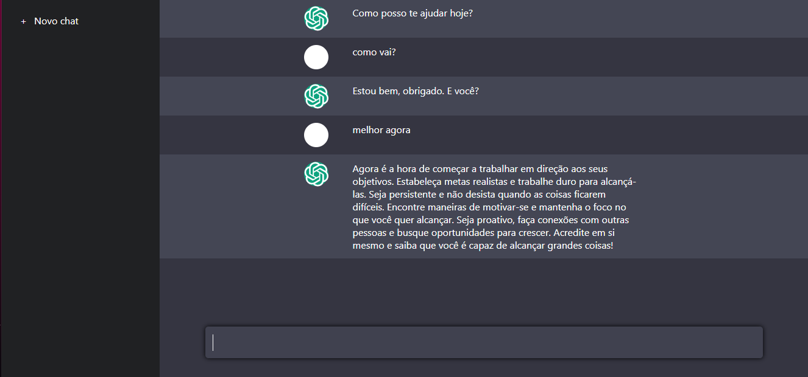

## Language / Lingua

- <a href ="#english"> English </a>

- <a href="#pt-br"> Português(Brazil)</a>

 

---

 

# ENGLISH

## ChatJP
- `in process...`

it's my clone project of the so famous ChatGPT, taught in a DIO programming course company, I was taught the back-end of how ChatGPT was created. But, the front-end was taken from Github https://github.com/felipeAguiarCode/node-react-chatgpt-clone and is in a slow process of modification, making the project more unique.

## Available Scripts

In the project directory, you can run:

### `npm start`

Runs the app in the development mode.\
Open [http://localhost:3000](http://localhost:3000) to view it in your browser.

The page will reload when you make changes.\
You may also see any lint errors in the console.

### `npm test`

Launches the test runner in the interactive watch mode.\
See the section about [running tests](https://facebook.github.io/create-react-app/docs/running-tests) for more information.

### `npm run build`

Builds the app for production to the `build` folder.\
It correctly bundles React in production mode and optimizes the build for the best performance.

The build is minified and the filenames include the hashes.\
Your app is ready to be deployed!

See the section about [deployment](https://facebook.github.io/create-react-app/docs/deployment) for more information.

### `npm run eject`

**Note: this is a one-way operation. Once you `eject`, you can't go back!**

If you aren't satisfied with the build tool and configuration choices, you can `eject` at any time. This command will remove the single build dependency from your project.

Instead, it will copy all the configuration files and the transitive dependencies (webpack, Babel, ESLint, etc) right into your project so you have full control over them. All of the commands except `eject` will still work, but they will point to the copied scripts so you can tweak them. At this point you're on your own.

You don't have to ever use `eject`. The curated feature set is suitable for small and middle deployments, and you shouldn't feel obligated to use this feature. However we understand that this tool wouldn't be useful if you couldn't customize it when you are ready for it.

## Learn More

You can learn more in the [Create React App documentation](https://facebook.github.io/create-react-app/docs/getting-started).

To learn React, check out the [React documentation](https://reactjs.org/).

### Code Splitting

This section has moved here: [https://facebook.github.io/create-react-app/docs/code-splitting](https://facebook.github.io/create-react-app/docs/code-splitting)

### Analyzing the Bundle Size

This section has moved here: [https://facebook.github.io/create-react-app/docs/analyzing-the-bundle-size](https://facebook.github.io/create-react-app/docs/analyzing-the-bundle-size)

### Making a Progressive Web App

This section has moved here: [https://facebook.github.io/create-react-app/docs/making-a-progressive-web-app](https://facebook.github.io/create-react-app/docs/making-a-progressive-web-app)

### Advanced Configuration

This section has moved here: [https://facebook.github.io/create-react-app/docs/advanced-configuration](https://facebook.github.io/create-react-app/docs/advanced-configuration)

### Deployment

This section has moved here: [https://facebook.github.io/create-react-app/docs/deployment](https://facebook.github.io/create-react-app/docs/deployment)

### `npm run build` fails to minify

This section has moved here: [https://facebook.github.io/create-react-app/docs/troubleshooting#npm-run-build-fails-to-minify](https://facebook.github.io/create-react-app/docs/troubleshooting#npm-run-build-fails-to-minify)

 

---

 

# PORTUGUÊS

## ChatJP
- `em processo...`

é meu projeto clone do tão famoso ChatGPT, ensinado em uma empresa de cursos de programação DIO, foi ensinado o back-end de como foi criado o ChatGPT. Mas, o front-end foi pego no Github https://github.com/felipeAguiarCode/node-react-chatgpt-clone e está em processo lento de modificação, deixando o projeto mais único. 

## Scripts disponíveis

No diretório do projeto, você pode executar:

### `npm start`

Executa o aplicativo no modo de desenvolvimento.\
Abra [http://localhost:3000](http://localhost:3000) para visualizá-lo em seu navegador.

A página será recarregada quando você fizer alterações.\
Você também pode ver erros de lint no console.

### `teste npm`

Inicia o executor de teste no modo de observação interativo.\
Consulte a seção sobre [execução de testes](https://facebook.github.io/create-react-app/docs/running-tests) para obter mais informações.

### `npm run build`

Cria o aplicativo para produção na pasta `build`.\
Ele empacota corretamente o React no modo de produção e otimiza a compilação para obter o melhor desempenho.

A compilação é minificada e os nomes dos arquivos incluem os hashes.\
Seu aplicativo está pronto para ser implantado!

Consulte a seção sobre [implantação](https://facebook.github.io/create-react-app/docs/deployment) para obter mais informações.

### `npm run eject`

**Nota: esta é uma operação unidirecional. Depois de 'ejetar', você não pode voltar!**

Se você não estiver satisfeito com a ferramenta de construção e opções de configuração, você pode `ejetar` a qualquer momento. Este comando removerá a dependência de compilação única do seu projeto.

Em vez disso, ele copiará todos os arquivos de configuração e as dependências transitivas (webpack, Babel, ESLint, etc) diretamente para o seu projeto, para que você tenha controle total sobre eles. Todos os comandos, exceto `eject`, ainda funcionarão, mas apontarão para os scripts copiados para que você possa ajustá-los. Neste ponto você está por conta própria.

Você nunca precisa usar `eject`. O conjunto de recursos selecionados é adequado para implantações pequenas e médias, e você não deve se sentir obrigado a usar esse recurso. No entanto, entendemos que esta ferramenta não seria útil se você não pudesse personalizá-la quando estivesse pronto para ela.

## Saber mais

Você pode aprender mais na [documentação do Create React App](https://facebook.github.io/create-react-app/docs/getting-started).

Para aprender React, confira a [documentação do React](https://reactjs.org/).

### Divisão de código

Esta seção foi movida para cá: [https://facebook.github.io/create-react-app/docs/code-splitting](https://facebook.github.io/create-react-app/docs/code- divisão)

### Analisando o tamanho do pacote

Esta seção foi movida para cá: [https://facebook.github.io/create-react-app/docs/analyzing-the-bundle-size](https://facebook.github.io/create-react-app/ docs/analisando-o-tamanho-do-pacote)

### Criando um Progressive Web App

Esta seção foi movida para cá: [https://facebook.github.io/create-react-app/docs/making-a-progressive-web-app](https://facebook.github.io/create-react- app/docs/making-a-progressive-web-app)

### Configuração avançada

Esta seção foi movida para cá: [https://facebook.github.io/create-react-app/docs/advanced-configuration](https://facebook.github.io/create-react-app/docs/advanced- configuração)

### Implantação

Esta seção foi movida para cá: [https://facebook.github.io/create-react-app/docs/deployment](https://facebook.github.io/create-react-app/docs/deployment)

### `npm run build` falha ao minificar

Esta seção foi movida para cá: [https://facebook.github.io/create-react-app/docs/troubleshooting#npm-run-build-fails-to-minify](https://facebook.github.io/ create-react-app/docs/troubleshooting#npm-run-build-fails-to-minify)
